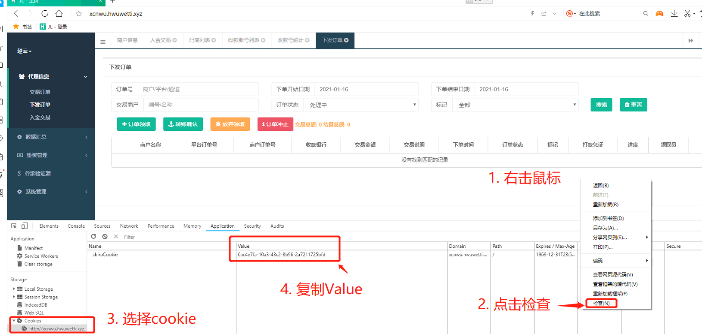

# 后台抢单系统

 该系统共有三个功能：
 * 开始抢单
 * 暂停抢单
 * 调整抢单频率

## 开始抢单

接口地址：http://81.68.87.47:6666/sd/{cookie}

使用时需将{cookie}切换为真实的cookie,示例：http://81.68.87.47:6666/sd/6ac4e7fa-10a3-43c2-8b96-2a7211725bfd

cookie获取教程：

## 暂停抢单

接口地址：http://81.68.87.47:6666/sd/pause

## 调整抢单频率

接口地址：http://81.68.87.47:6666/sd/waitTime/{等待时间}

使用时需将{cookie}切换为等待时间（单位：毫秒），示例：http://81.68.87.47:6666/sd/waitTime/3000， 意为调整抢单频率为3000毫秒（3秒一次）
PS:因服务器（因涉及服务器性能问题，频率不能低于3000毫秒）
